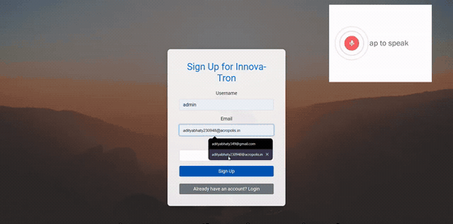
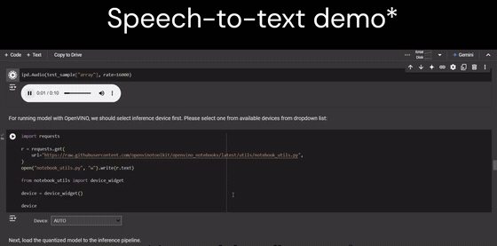

# Innova-Tron

Real time speech transcription, English to Hindi translation, and handwriting
recognition, wrapped in one Django REST API.

Built for the **Intel IEEE INDICON 2024** track, 30 November to 4 December 2024.

---

## The problem it targets

India has over 1,600 languages. A student who grew up speaking one of them can
end up in a classroom, seminar or workshop delivered in another, and the barrier
is not intelligence but medium. The gap shows up in lectures they cannot follow
and notes they cannot read back.

So the tool does three things at the point of use: hear it, read it, and turn it
into the language the student actually thinks in.

---

## What it does

### Speech to text, then translate



Audio goes to Google Cloud Speech-to-Text at 16 kHz LINEAR16, and the transcript
comes back into the page. From there it can be translated to Hindi through a
local MarianMT model, `Helsinki-NLP/opus-mt-en-hi`, running through Hugging Face
`transformers` rather than a paid translation API.

The translation is deliberately narrow. `translate_text()` raises if the target
language is anything other than Hindi, rather than silently returning bad output
for a pair the model was never trained on.

### Handwriting recognition



Handwritten Devanagari characters are read off an image and returned as text, so
a textbook page or a set of handwritten study notes becomes something that can
be searched and translated.

This is the part that runs on **Intel OpenVINO**. The model is loaded as IR
through `openvino.runtime.Core`, compiled for CPU, and called directly. That is
the reason the project fits the Intel track: inference stays local on ordinary
CPU hardware rather than requiring a GPU or a hosted endpoint.

---

## API

Django REST Framework, JWT auth through `rest_framework_simplejwt`.

| Method | Route | Auth | Purpose |
|---|---|---|---|
| POST | `/api/signup/` | no | Create a user |
| POST | `/api/login/` | no | Returns access and refresh tokens |
| POST | `/api/ai-processing/` | yes | OpenVINO inference on submitted input |
| POST | `/api/speech-to-text/` | yes | Upload audio, get a transcript |
| POST | `/api/translate/` | yes | English to Hindi |

The three AI routes all require a valid token. Uploaded audio is written to
`./uploads/`, transcribed, then deleted in the same request.

---

## Running it

```bash
pip install django djangorestframework djangorestframework-simplejwt transformers openvino google-cloud-speech python-dotenv torch
```

Copy `.env.example` to `.env` and fill in both paths, then:

```bash
python manage.py migrate && python manage.py runserver
```

`MODEL_PATH` must point at the OpenVINO IR `.xml` file.
`GOOGLE_APPLICATION_CREDENTIALS` must point at a Google Cloud service account
JSON with the Speech-to-Text API enabled. Neither file is in this repository.

---

## Known state

Published as written during the competition, not tidied up afterwards.

**`views.py` and `backend.py` are near duplicates.** Both define the same five
API classes and the same three helper functions. `urls.py` imports from
`views.py`, so `backend.py` is the dead copy. It differs only in calling
`django.setup()` and building a WSGI application at import time, which is what
made it a scratch entry point during development.

**There is a second, unrelated Flask app.** `app.py` serves `templates/` with its
own login and signup, backed by a Python dict holding one demo account. It shares
no code and no user store with the Django API. It was the front end shell while
the API was being built.

**`models.py` and `serializers.py` are empty.** The project uses Django's built-in
`User` and hand-rolled request parsing instead.

**`DEBUG = True` and the Django `SECRET_KEY` is a placeholder** rather than a
generated key. Both would need changing before this was exposed to anything.

**The default `MODEL_PATH` in `backend.py` points at a directory, not a model
file.** It falls back to the virtual environment folder, which cannot be read as
IR, so `compiled_model` ends up `None` and every inference call raises. The
`.env` path is what actually made it work.

---

## Repository history

This repo was **118 MB across 33,878 files** for a project whose source is
**17 files**.

`venv/` and `openvino_env/` were both committed, so every clone pulled two
complete Python environments including a 42 MB OpenVINO CPU plugin binary and a
38 MB OpenBLAS DLL.

History has been rewritten to remove them, along with `db.sqlite`, the committed
`.env`, and a stray `tempCodeRunnerFile.py`. The repository is now **404 KB**.
Commit dates and authorship are unchanged.

`.env.example` replaces the committed `.env`. Neither ever held a secret, only
local paths, but the real one does not belong in git.

---

## Team

Aditya Bhaty · Aditya Naidu

Commits from this period appear under `Adi-ctive` and `Faith1406`.

---

## Links

| | |
|---|---|
| Demo video | https://www.youtube.com/watch?v=SXIICG16GOc |

The two clips above are from the demo section of that video. The rest of it is
stock footage, plus third-party application recordings that belong to their
respective owners.
